# Chapter four – Methods and Encapsulation

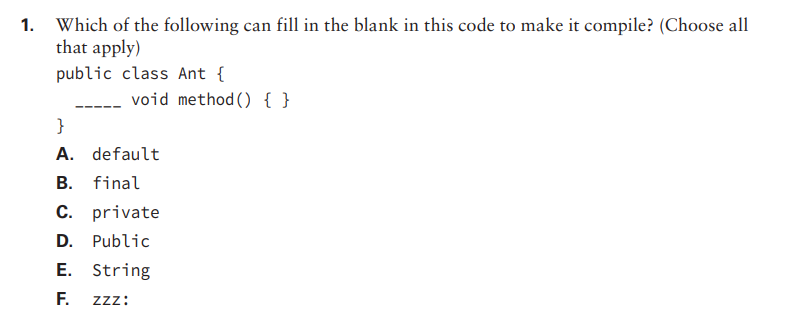

- ## 1: Options B and C. Option A is incorrect because 'default' is is an access modifier, but it's correct syntax is ommiting the word. Option D is also wrong because 'public' is an access modifier, but Java is a case sensitive language, and access modifiers should have lowercase only. Option E is incorrect because only access modifiers and 'static' or 'final' are allowed before the return type. And finally, option F is wrong because methods do not allow labels.

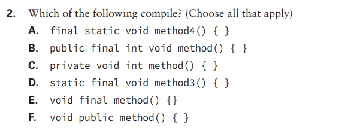

- ## 2: Options A and D only. Option B is incorrect because you can't have two return types, same goes for option C. Option D is incorrect because return types must go after 'final' modifier, and F is incorrect because of the same reason, but now the access modifier is the one that should precede the return type.

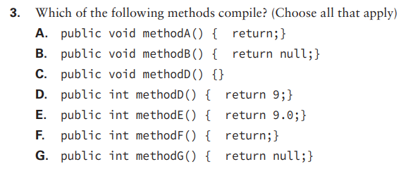

- ## 3: Options A, C and D. Option B is incorrect because you can't return null in a void method. Option E is incorrect because Java can't cast double to int to return it. Option F is incorrect because if there's a return type other than void, you must return some value of that type or null. And finally, option G is incorrect because Java can't cast null inside a primitive type.

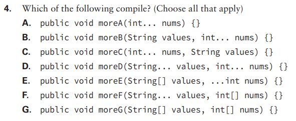

- ## 4: Options A, B and G. Option C is incorrect because we should always put varargs as the last parameter. Same goes for C, D and F. Option E is incorrect because the three dots should come after the varargs type.

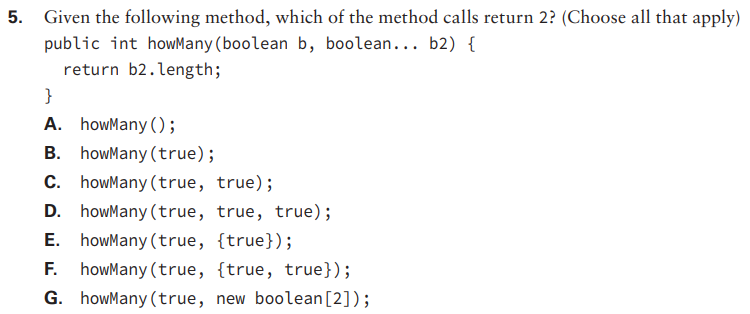

- ## 5: Options D and G. Java reads varargs as being arrays, so we can call them putting the desired amount of correct-type variables, or and array. I the case of option D, we put two variables after 'boolean b', and in G we put an array of length 2.

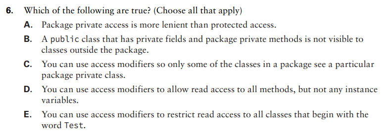

- ## 6: Option D is the only one correct, because Java can't restrict access to specific classes with a certain name, nor distinguishes between wich classes have access to a package private class, but you can set your methods to be accessible and your variables not, making it read-only.

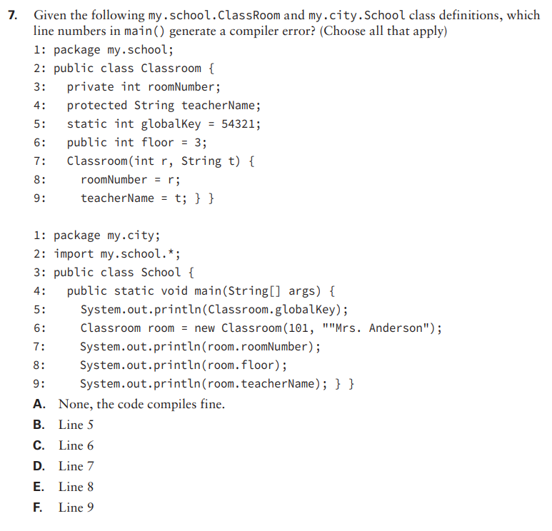

- ## 7: Options B, C, D and F. These lines don't compile because private access and default access will compile only for classes in the same package. Protected access also won't compile since 'School' does not inherit from 'Classroom'.

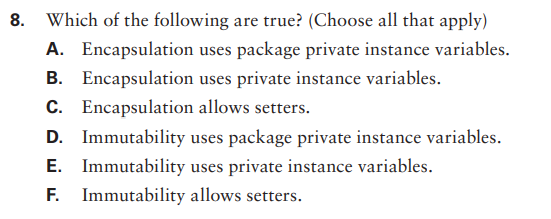

- ## 8: Options B, C, E. Option A is false because package private does not make encapsulation, private does. Option D is incorrect because of the same concept. And option F is incorrect because in order to be immutable, you can't allow variables to be set.

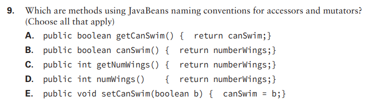

- ## 9: Options C and E. Option A is false because we should use 'is' before the name of a boolean getter. Options B and D both should have 'get' in the beggining of the name.

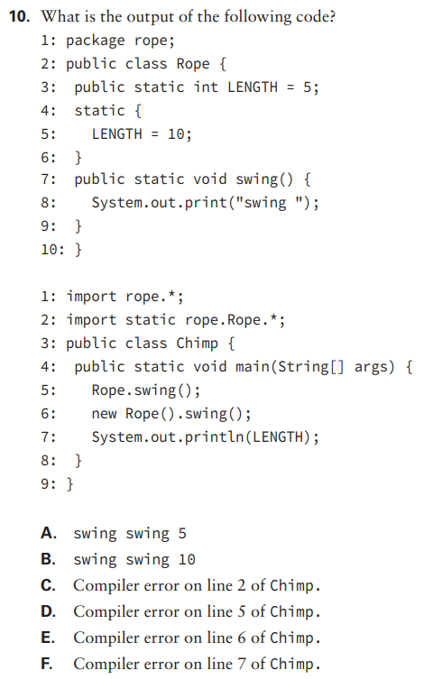

- ## 10: Option B. 'LENGTH' is set to 10, then 'Rope.swing();' and 'new Rope().swing();' both print 'swing', finally we print 'LENGTH'.

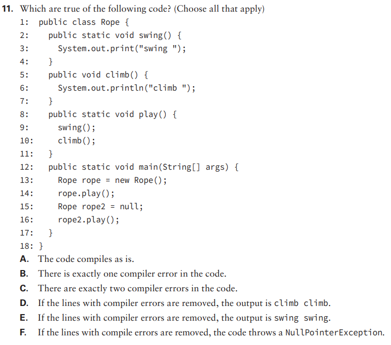

- ## 11: Options B and E. Line 10 doesn't compile because static methods are not allowed to call instance methods. If we fix it, the output is 'swing swing'.

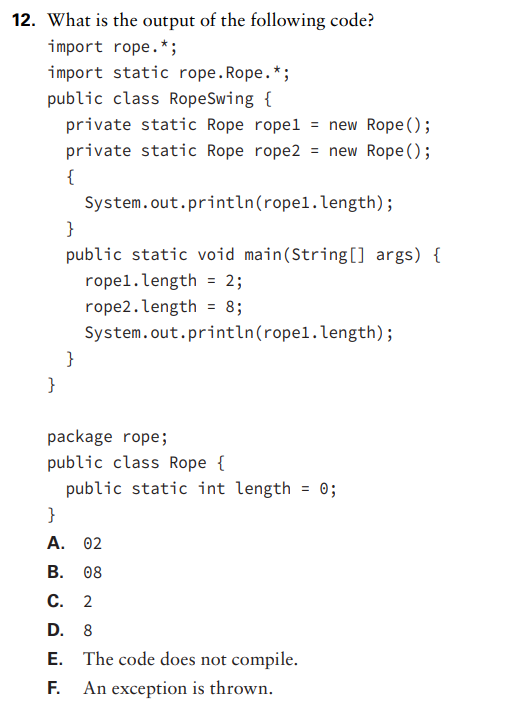

- ## 12: Option D. Since 'length' is a static variable, changes in one of the 'Rope' instances will affect the other. 

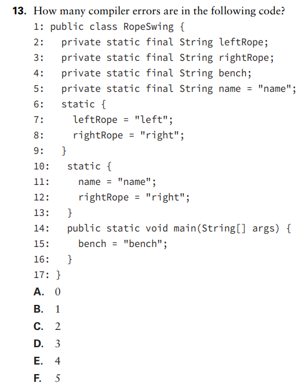

- ## 13: Option E. Line 4 does not compile because it wasn't set in the declaration line nor in a static initialization block. Line 15 does no compile because you can't set final variables more than once. Line 11 does not compile for the same reason as line 15, as does line 12.

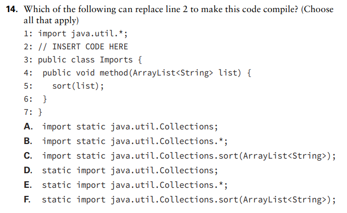

- ## 14: Option B. Option A is false because 'Collections' isn't static, so it can't be imported in a static way. Option C is incorrect because imports do no have method parameters. The rest are trick questions, because they inverted the order of the syntax.

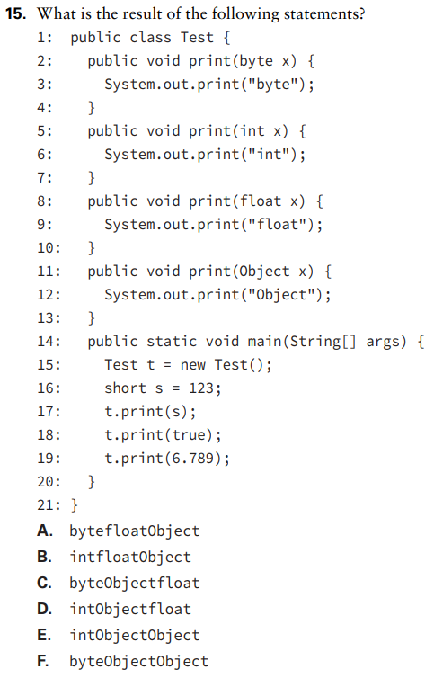

- ## 15: Option E. It prints intObjectObjec because 'short' gets boxed into int, while 'true' and '6.789' are considered Objects because they can be boxed into Boolean and Double.

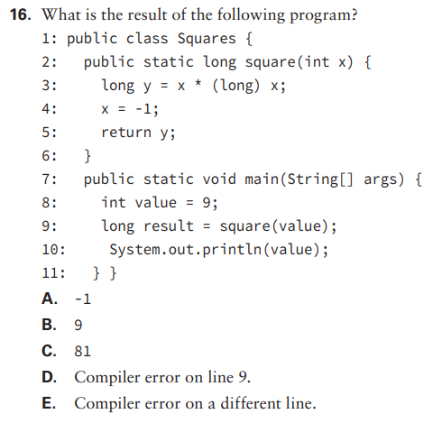

- ## 16: Option B. We assign 'value = 9' and then do not modify it later. Java is pass by value, not pass by reference, so it doesn't get reassigned inside square().

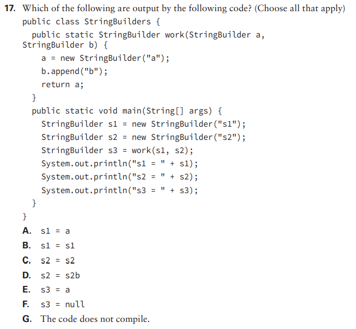

- ## 17: Options B, D, and E.  Calling append() affects the caller because both the method parameter and caller have a reference to the same object, so 'b.append("b")' changes 's2' to s2b' and since 'work' sets 'a' to 's3', it ends with 'a'.

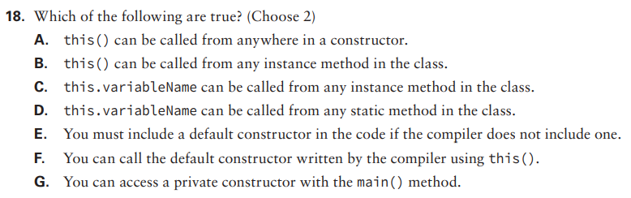

- ## 18: Options C and G. 

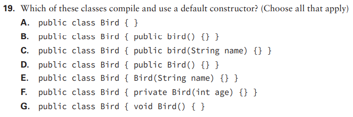

- ## 19: Options A and G.  Options B and C re incorrect because the constructor name has to match the classname. Options D, E, and F compile but do not use the default constructor. Option G defines a method, but not a constructor. Option A does not define a constructor either, making Java provide the default constructor for them.

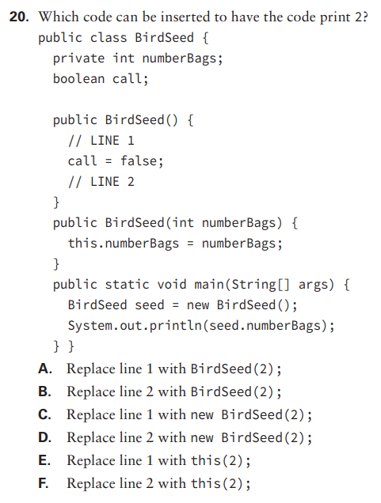

- ## 20: Option E. Options A and B don't compile because the syntax is wrong, we must use 'new' to call a constructor. Options C and D will compile but will create a new object instead of setting the fields in the existing one, and option F won't compile because 'this()' must be the first line of a constructor.

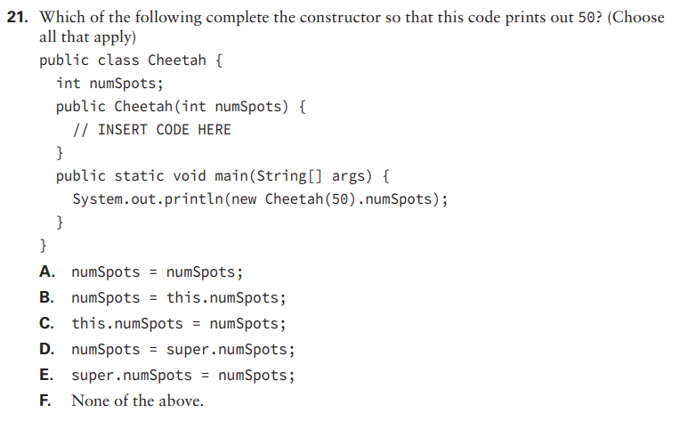

- ## 21: Option C. Option A sets the constructor parameter to itself, leaving the instance variable as 0. Option B sets the constructor parameter to the value of the instance variable, making them both 0. Options D and E do not compile.

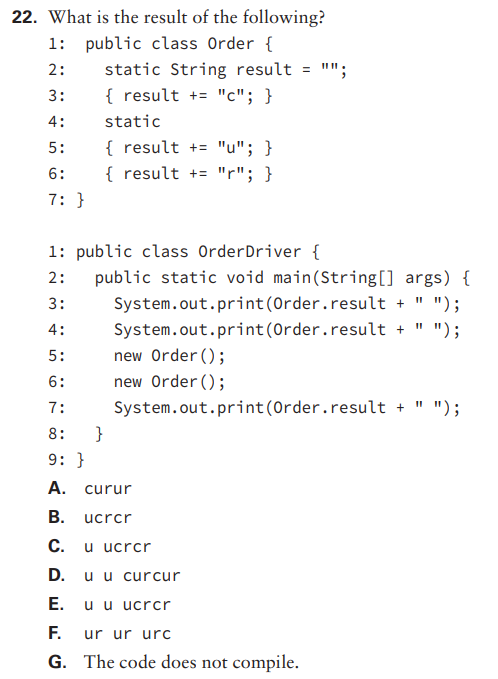

- ## 22: Option E. 

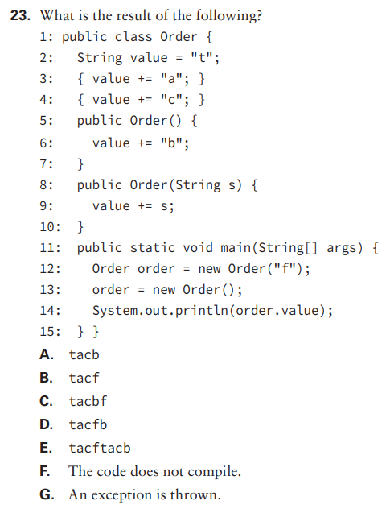

- ## 23: Option A, the code compiles, there are no exceptions and it results in 'tacb'.

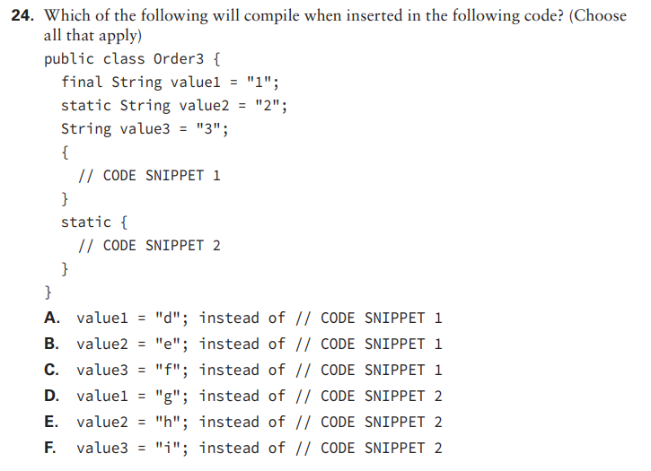

- ## 24: Options B, C, and E. Option A doesn't compile because the final variable was already set in the declaration, and options D and F do not compile because a static initializer does not have access to instance variables.

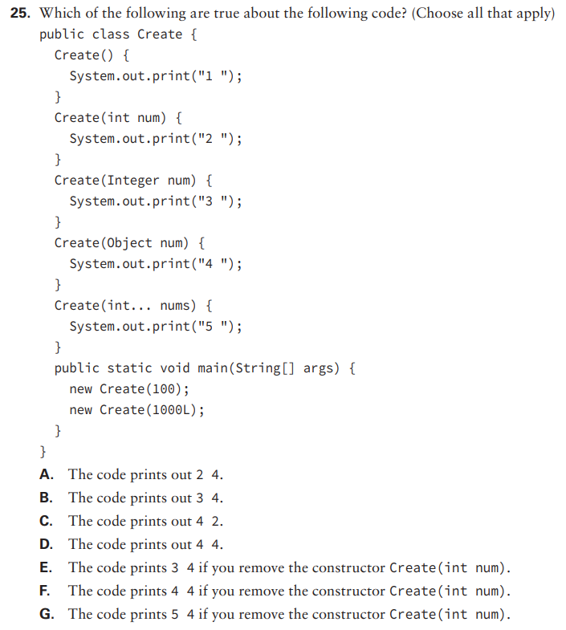

- ## 25: Options A and E. 

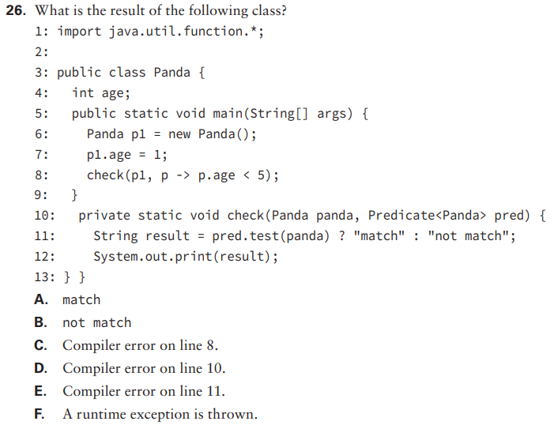

- ## 26: Option A. It prints 'match' because the predicate tests if 'age' is less than 5, and it's correct.

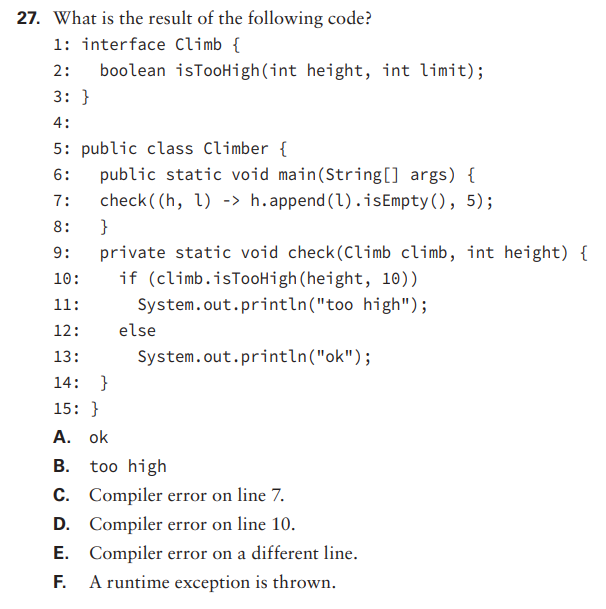

- ## 27: Option C. Line 7 tries to use the int 'height' as a StringBuilder, which is not allowed;

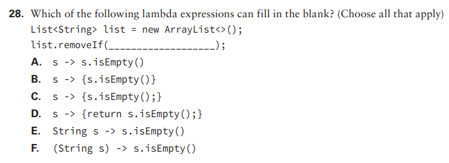

- ## 28: Options A, D, and F.  Options B and C are false because they don't have a 'return'. Option E is incorrect because it's missing the parentheses around the parameter list.

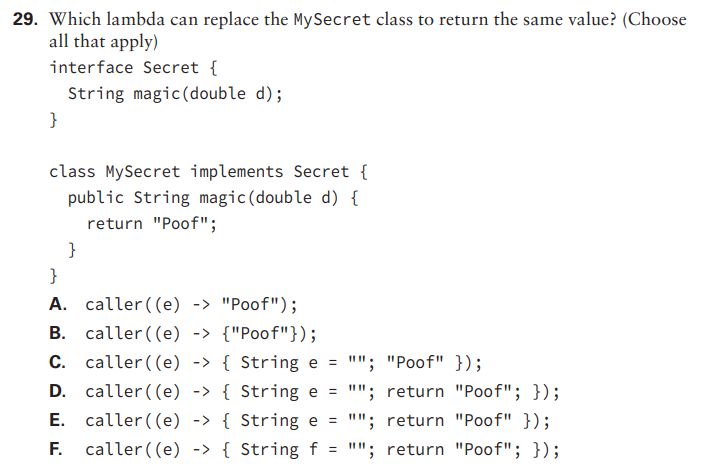

- ## 29: Options A and F. Option B is incorrect because it does not use the return keyword. Options C, D, and E are incorrect because the variable 'e' is being used in the lambda and cannot be redefined.
