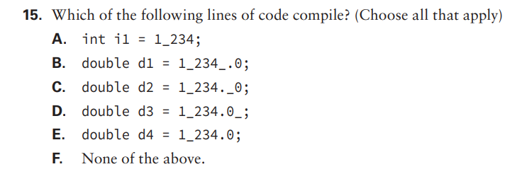
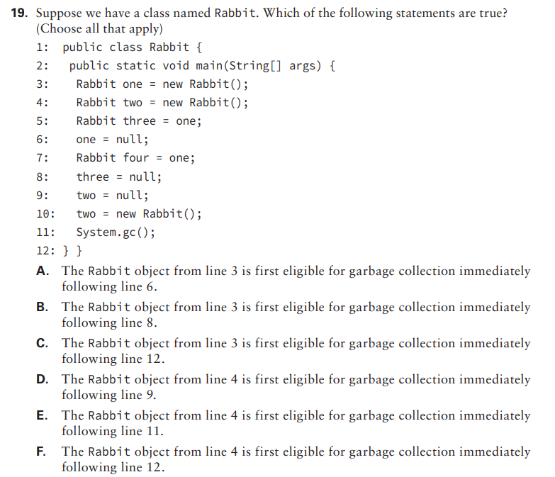

# Chapter one – Java Building blocks

- ## 1: Options A, B and E. Option C is a Java reserved word, so it is not legal as an identifier. Option D has a dot, which is also a reserved character, making it and illegal identifier. Option E would fall under the same category, the word ‘public’ is a reserved word, but since Java is a case sensitive language, the word ‘Public’ is allowed. You can not begin an identifier in Java with numbers, therefore option F is illegal too.

---

- ## 2: Option D. Option A is false because line 6 is a valid line, same for option B. Option C is false because there is indeed an output, generated by the sysout command. Option E is false because, although ‘empty’ is a boolean automatically initialized with the value ‘false’, the String ‘Brand’ is an object, and objects in Java are always initialized as null when not declared a value. Option F is false because ‘empty’ is a boolean, which is a primitive type. Primitive types in Java do not support null values.

---

- ## 3: Options B, D, E. Option A is false because the initialization is correct. Option B is true because int does not support decimals. Option C also has a correct initialization. Option D is true because short is a primitive type, therefore doesn’t support methods. Option E is also true for the same reason. Option F is false because in line 9 we have a method being accessed from an Object, which supports methods inside of it. Option G is false because there are compiling errors mentioned above.

---

- ## 4: A and B. A is true because if we insert the String on line 2, it becomes a class variable, which is accessible everywhere in the scope of the class. Option B transforms our String in a scope variable, which means it can be accessed by the sysout because they would be in the same scope. Option C would also transform the String in a scope variable, but the scope would end on line 7, making it impossible for the sysout to access. Option D would initialize the variable after it’s use, meaning that the compiler wouldn’t know about the existence of the String when we call sysout on it, therefore it’s also false. Option E is false because A and B would make it compile.

---

- ## 5: C and D. Option A is false because importing a wildcard will import the classes within the package, but not the child packages. Option B is false because you can only use a wildcard as the last thing on the import declaration. Option C works because we are importing specifically the class ‘Jelly’. Option D also works because we are using a wildcard to import every class inside ‘jelies’, which includes ‘Jelly’. Option E is false because you cannot import beyond classes. And option F is false because  options C and D would compile.  

---

- ## 6: 4 imports.  Java.lang does not need to be imported, since it’s imported automatically in every class, same goes for every package inside of it. We can remove either ‘aquarium.Water’ or ‘aquarium.*’, since both will import the class ‘Water’, or we could remove both, because ‘Tank’ and ‘Water’ are in the same package, hence being visible to each other.

---

- ## 7: A, B, and C. Option A is true because it imports the class ‘Water’ from the package ‘aquarium’. B and C are true because they import directly by class name, and class name always have preference over wildcards. Option D is false because Java won’t know which ‘Water’ we want. Option E is also false because we cannot import two classes with the same name, to avoid confusion. Option F is false because A, B and C would make the code compile.

---

- ## 8: Option B. Option A is false because it would print out ‘Blue’. Option B prints out ‘Blue Jay’ because arguments with spaces must be in quotes to be recognized as one argument, not multiple. Option E and F are false because when we run a Java program through the CLI, we are not supposed to use the ‘.class’. Option G is false because B would compile and run.

---

- ## 9: A, C, D and E. A is true because it states the type, array of arguments and the name of the variable might start with an underscore. Option B is false because variable names cannot start with numbers. Option C is true because the array declaration can be placed either after the type declaration or the variable declaration. Option D is also true because variables may start with underscores. Option E is true because we can use varargs instead of the array declaration and variables can start with the dollar sign. Option F is false because it does not have neither the array declaration nor varargs. And Option G is false because options A, C, D and E would be legal.

---

- ## 10: Only option E. Option A is false because the main method must be public. Option B is false because the main method needs a return type and not be declared final like a variable.Option C is false because the main method needs to be static. Option D is false because the main method must be named ‘main’. Option E is the standard way of declaring the main method. Option F is false because the main methos needs a return type, and option G is false because option E is the standard correct way of writing a main method.

---

- ## 11: C and D. A is false because double is a primitive type, and only Objects can refer to null, same goes for option B. Option C is true because String is an Object, all Objects default to null. Option D is also true because double is a primitive type and indeed defaults to 0.0. Option E is false because int is a primitive type that consists only of integer numbers, thus not supporting the dot. The default for an int is 0. Option F is false because, as previously stated, String is an Object, and Objects default to null, not 0.0. Finally, option G is false because C and D are true.

---

- ## 12: G, none of the above. The question is about local variables, not instance variables. Local variables do not have a default value, we must initialize them or else the code does not compile.

---

- ## 13: A and D. Both boolean and int are primitive types, so they cannot be assigned null. We can use the Objects Integer and Boolean if we want them to support null values. A and D are true because de default of boolean is false and the default of int is 0.

---

- ## 14: Option D. We are already compiling from ‘/my/directory’, so we don’t need to explicitly declare like option B. Option C is fales because package names are case sensitive, and options E and F are false because the package ‘A’ isn’t directly under the package ‘directory’, it is under the package ‘named’. The compiler would look for the package ‘A’ inside ‘directory’, but would only find ‘named’.

---

- ## 15: A and E. Options B, C and D are false because undescores only are allowed between two numbers, not on the end nor beginning, neither before or after a dot.

---

- ## 16: B, C and D. Option A is false because the ‘L’ notation after the number exists to declare a long value, not an int. B is true because the ‘b’ between the numbers refers to a binary value, while C and D are also true because the ‘x’ refers to a hexadecimal value. Both ‘b’ and ‘x’ are valid notations for many primitive types. Option F, on the other hand, is false because it has an underscore and the last digit, which is not allowed.

---

- ## 17: A and E. Option B is false because ‘bun’ is not a class, but a reference to an object, as stated by option E. Option C is false because ‘main’ is not a class, but a method. Option D is false because ‘Bunny’ is a class. Option F is false because, as said before, ‘main’ is a method.

---

- ## 18: C, D and E. Option C is true because, when present, the order must be 1 º Package, 2º Import and 3º Class declaration. Option D is true because the declaration for a package is optional, and when not present the correct order is  1º Import and 2º Class declaration. Option E is true because imports are also optional, and when not present the correct order is 1 º Package and 2º Class declaration.

---

- ## 19: B and D. Option A is false because ‘Rabbit one’ still has a reference from line 5. Option B is true because at line 8, we null the only reference left for ‘Rabbit one’. Option C is false because the eligibility starts at line 8. Option D is true because at line 9 we null the only current reference to ‘Rabit two’. Option E is false because the eligibility starts at line 9, as stated in the option D. Also, calling System.gc() wouldn’t change the eligibility for garbage collection. Option F is false for the same reason as option E.

---

- ## 20: B and E. Option E is true because when we call ‘System.gc()’, we are only suggesting Java to run the garbage collector, in which it may or may not run. If it runs, the ‘finalize()’ method will be called, making option B also true.

---

- ## 21: Option A. Although line 3 has a method with the same name as the class, it is not a constructor because it has a return type.

---

- ## 22: B and E. Java does not allow operator overloading (which is a manner in which OO systems allow the same operator name or symbol to be used for multiple operations), nor it allows pointers (which is a variable that stores the memory address of an object). Java compiled code does run in either platforms because java compiled code is platform independent, and Java is an object-oriented language with a few functional programming parts on class level.

---

- ## 23: C and D. ‘javac’, the java compiler, compiles the sourcecode (which is in a ‘.java’ file) into bytecode with the extension ‘.class’. It takes the class name as a parameter, but without the extension.

---