# Chapter three – Core Java APIs

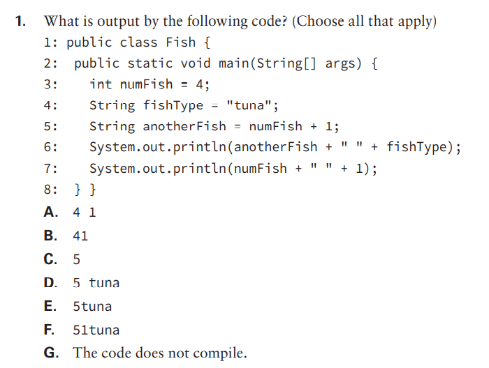

- ## 1: Option G. The code does not compile because Java understands that int + int == int, and does not cast that to String. We need at least one String variable in the equation for Java to understand the '+' as concatenation and not addition.

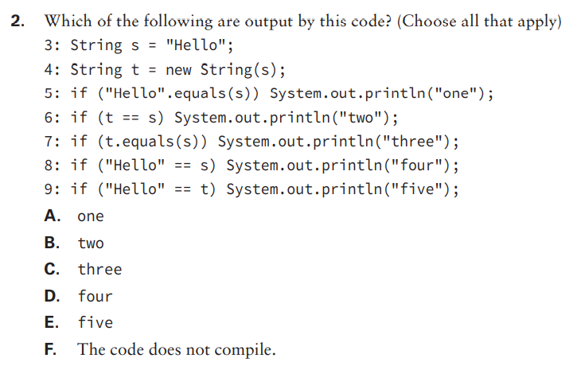

- ## 2: Options A, C and D. Option A and option C because the 'equals' is comparing the content of the String objects. Option D because "Hello" and 's' are in the same String pool, therefore being compared as the same object.

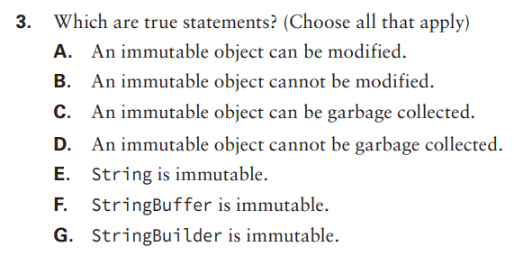

- ## 3: Options B, C and E.

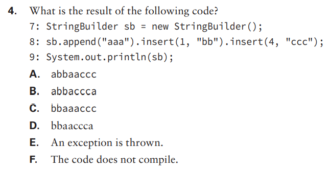

- ## 4: Option B. The code compiles, and StringBuilder.insert() function takes the slot on the String as the first parameter, starting on 0.

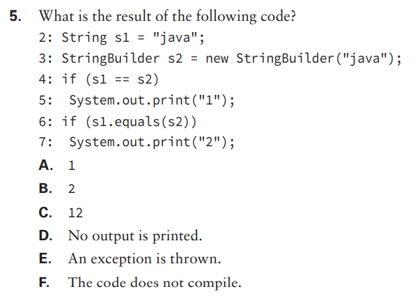

- ## 5: Option F, the code does not compile because you can't compare String to StringBuilder through '=='.

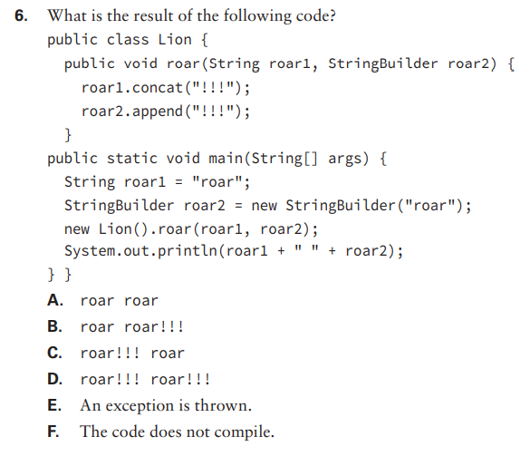

- ## 6: Option B. We may call .concat() on a String, but if we don't capture the return, it does nothing, because a String is immutable. The StringBuilder, on the other hand, is muttable, and is changed through .append().

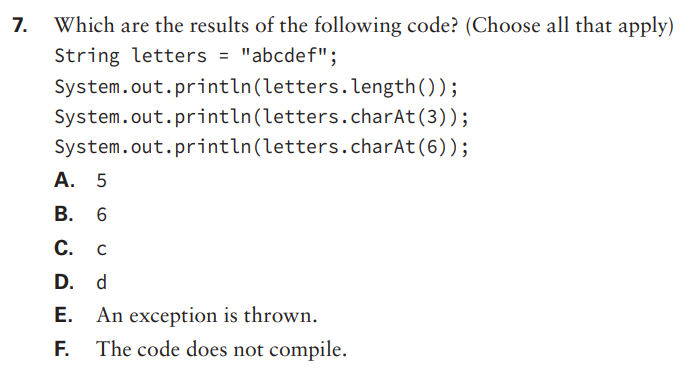

- ## 7: Options B, D and E. The code compiles, but throws an OutOfBoundsException when going through the last line.

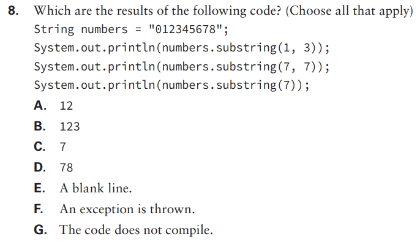

- ## 8: Options A, D and E. Substring, when used with two parameters, gets the caracters at the positions 'parameter1' and right before 'parameter2'. But when it is used with only one parameter, it goes on from that position until the end of the String.

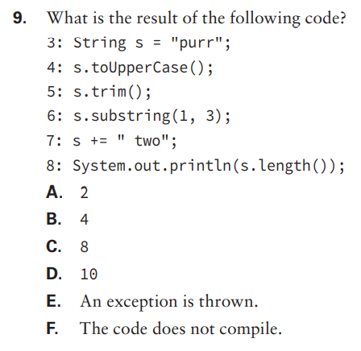

- ## 9: Option C. Strings are immutable, so calling toUpperCase(), trim() or .substring(1, 3) on it will do nothing to the original String. But when we use '+=' with one or more Strings, Java understands that it must concat them.

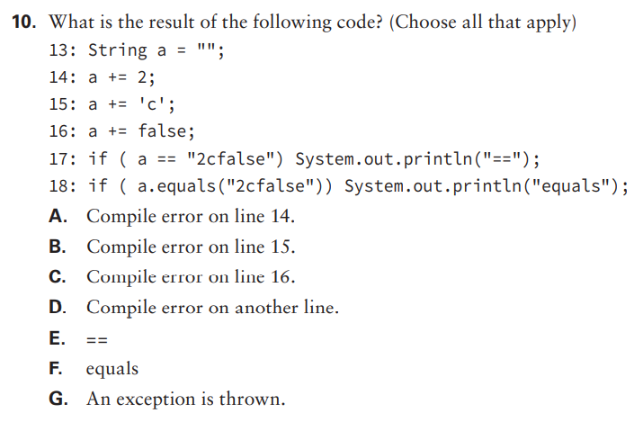

- ## 10: Option F. The code compiles just fine and the concatenations occur, but when we use '==' it compares objects, not content.

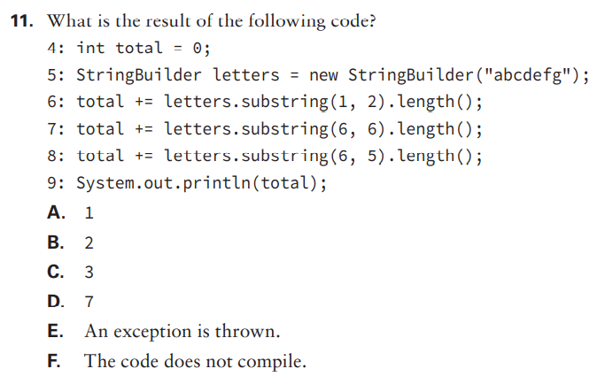

- ## 11: Option E. An IndexOutOfBoundsException is thrown because on line 8 the indexes are reversed.

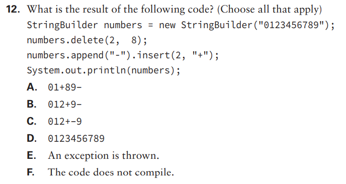

- ## 12: Option A.

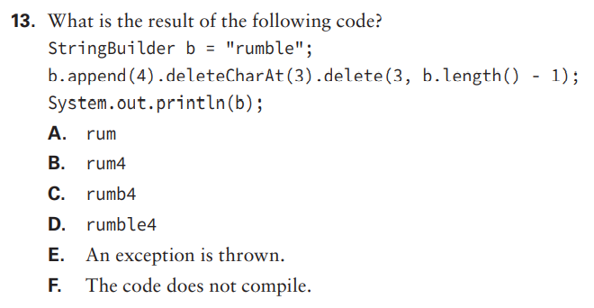

- ## 13: Option F. We can't assign Strings to StringBuilder. The correct way would be StringBuilder b = new StringBuilder("rumble").

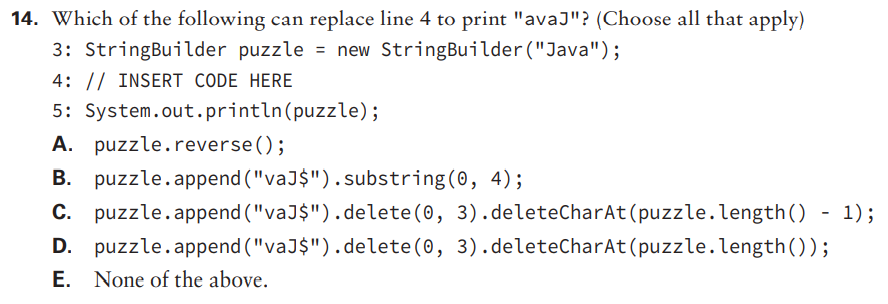

- ## 14: Options A and C. Option A is the easiest way, but we could append the reverse, delete the first three letters ("Jav") and then delete whatever isn't necessary.

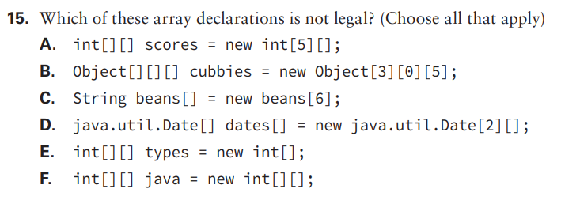

- ## 15: Option C, E and F. Option C is wrong because it uses the name of the variable as a type, and options E and F are wrong because they don't sepcify the size of the array.

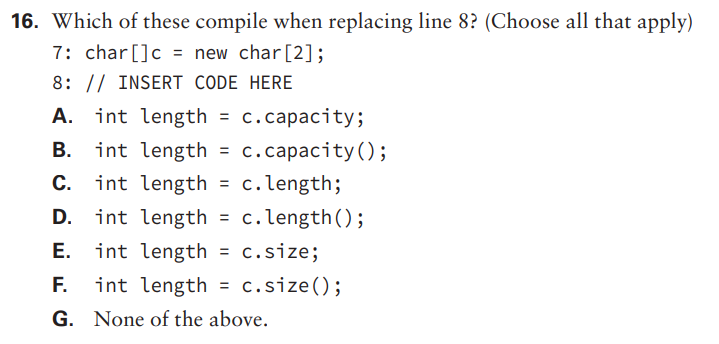

- ## 16: Option C. The property 'length' of arrays is used to retrieve the amount of slots it has.

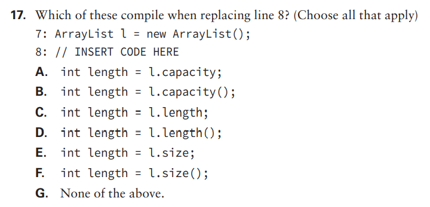

- ## 17: Option F. ArrayList, not like arrays, has a method 'length()' to retrieve the amount of slots it has.

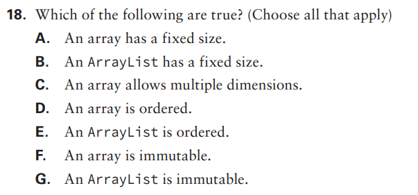

- ## 18: Options A, C, D, E.

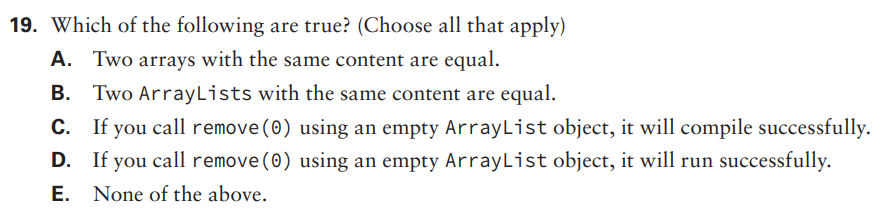

- ## 19: Options B and C. Two ArrayLists with the same content are equal because ArrayList compares content through it's equals() overriding. If you call remove(0) using an empty ArrayList object, it will compile successfully, but it won't run successfully, it will throw an indexOutOfBoundsException.

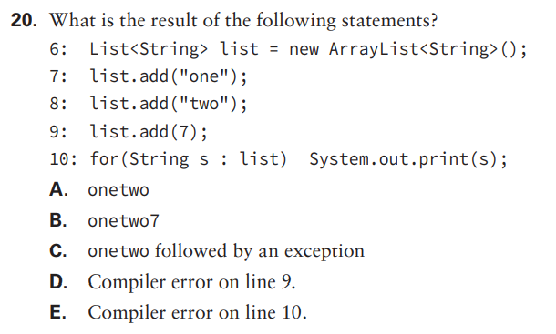

- ## 20: Option D. The code won't compile because we defined that only String objects could be added to the list.

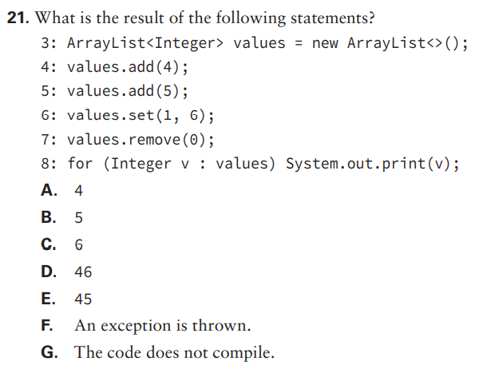

- ## 21: Option C. First we add 4 to the list, then 5, then substitute 5 with 6, then remove 4, being left with 6.

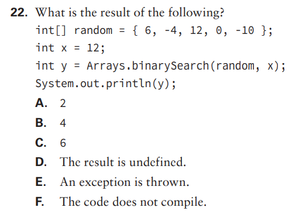

- ## 22: Option D. We cannot know the result because the array is not sorted.

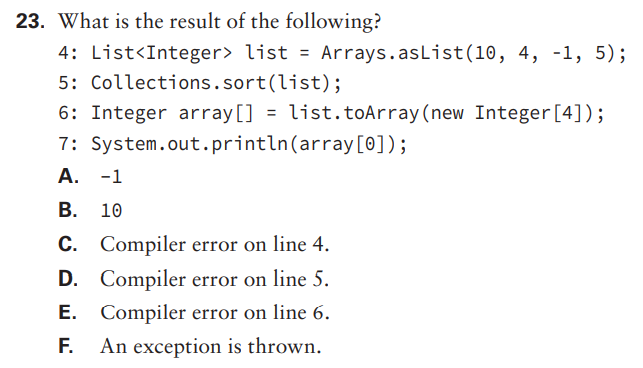

- ## 23: Option A. First we create an Integer List, populating it. Then we sort it and convert it back to an array, printing the first sorted position.

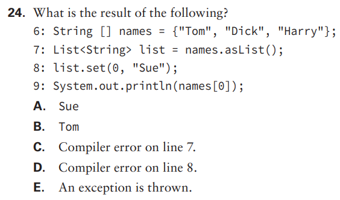

- ## 24: Option C. To convert an array to a list, we use Arrays.asList(names). The 'names.asList()' does not exist.

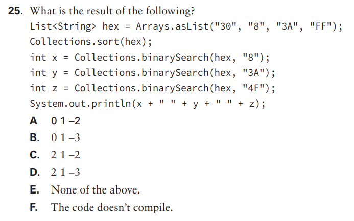

- ## 25: Option D. The sorting goes Number -> LETTER -> letter, so it sorts to s [30, 3A, 8, FF]. The binary seraches finds '8', '3A' but not '4F', returning then the index it should be, reversed and -1.

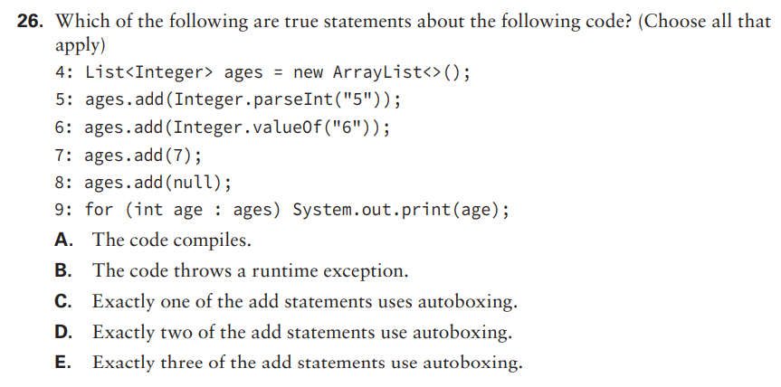

- ## 26: Options A, B and D. Lines 5 and 7 use autoboxing, and when the 'for' tries to unbox 'null' into int, it throws a NullPointerException.

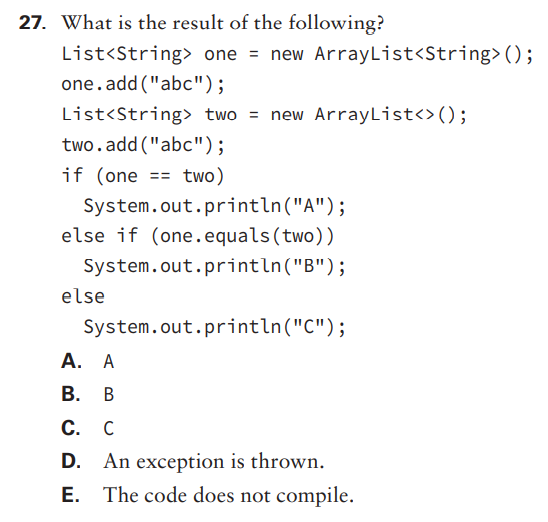

- ## 27: Option B. The equals() compares content, so they are the same.

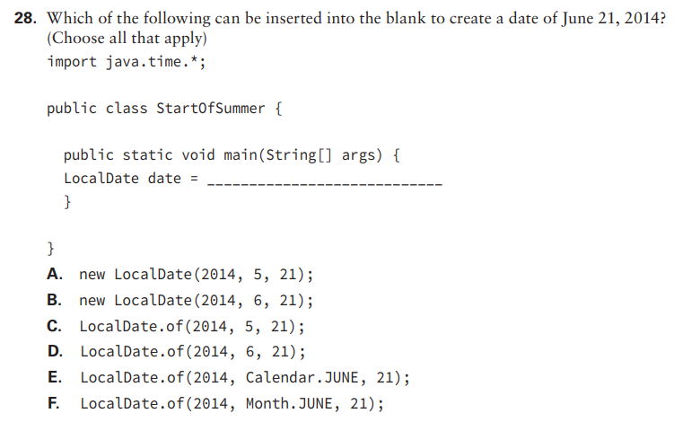

- ## 28: Options D and F.

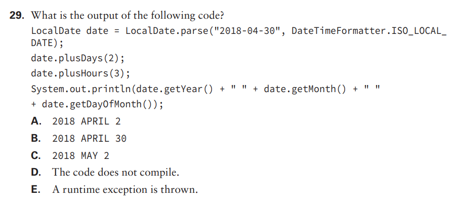

- ## 29: Option D. We can't add hours to LocalDate, it only supports dates.

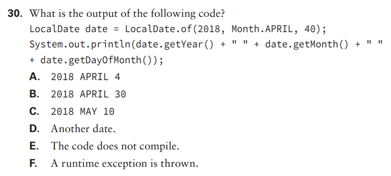

- ## 30: Option F. We can't set '40' as a day because months have at most 31 days, so Java throws an exception.

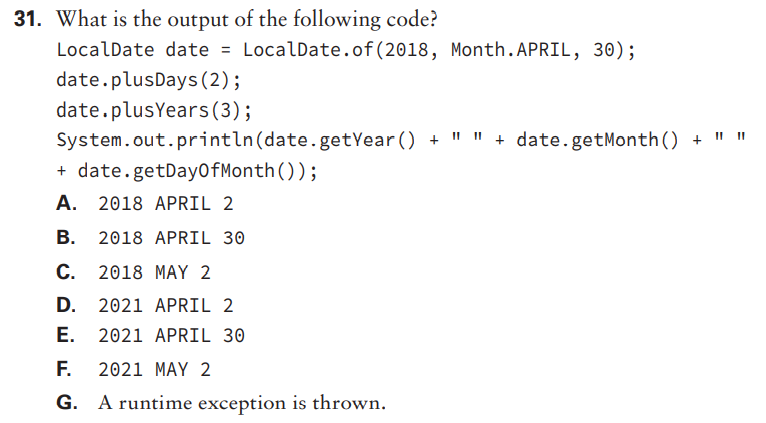

- ## 31: Option B. Since LocalDates are immutable, 'date.plusDays(2)' or 'date.plusYears(3)' does nothing to 'date'.

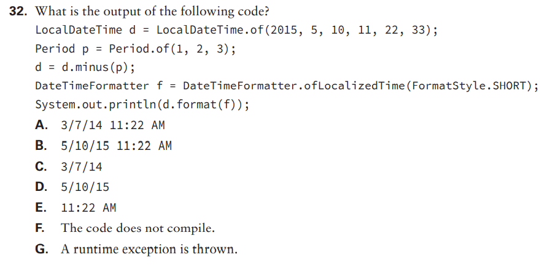

- ## 32: Option E. When we use the formatter, it trims the dates and only keeps the time.

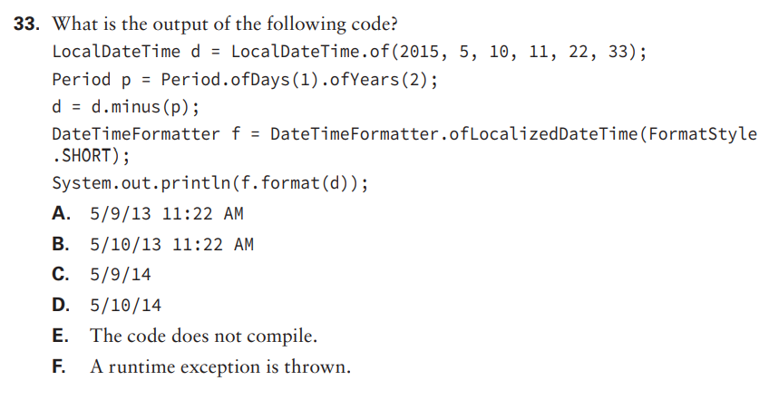

- ## 33: Option B. Since 'Period' does not allow chaining methods, only the last one is applied.

