# Chapter two – Operators and Statements

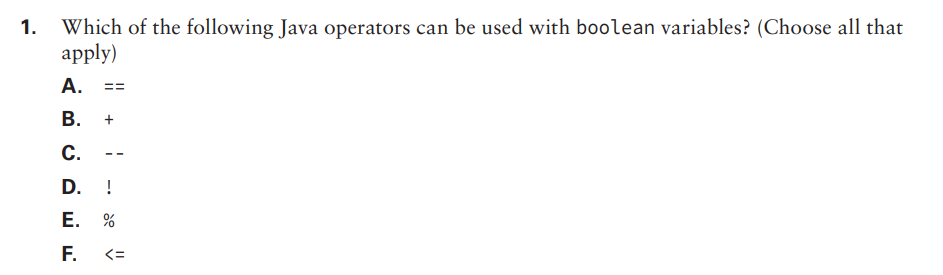

- ## 1: Options A and D. The options B, C E and F refer to operators for numerical types, while the options A and D are the equality operator and the logical complement operator, respectively.

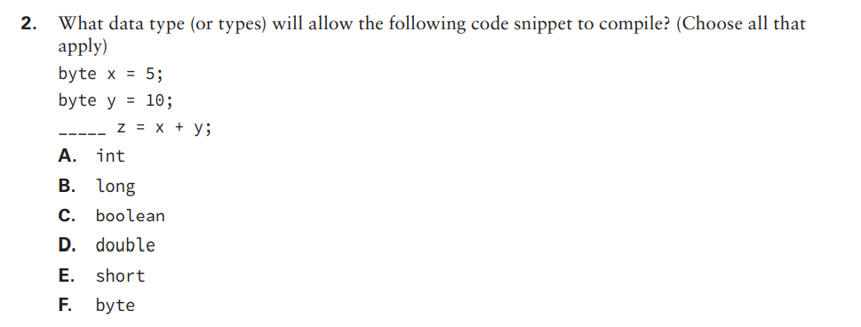

- ## 2: Options A, B and D. When we sum two byte values, the result will automatically be casted to int, so whatever type that fits ints can be used on this operation. In this case, those are int, long and double.

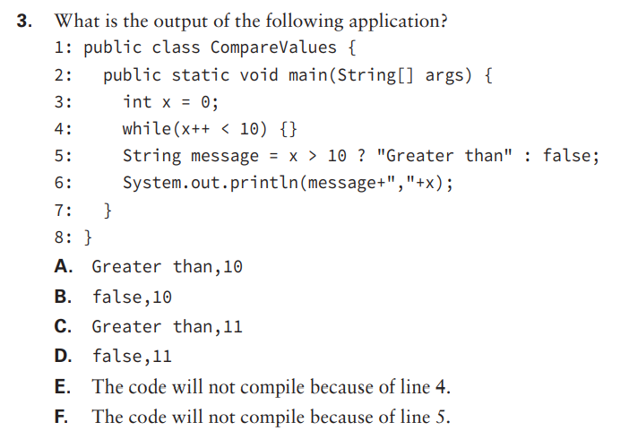

- ## 3: Option F. On line 5, we have a ternary operation to determine what wil be applied to the variable 'message'. This ternary would not compile because we are applying a boolean value in the false part, when we have already estabilished that 'message' would receive a String, not a boolean., so the compiler would not know how to cast that.

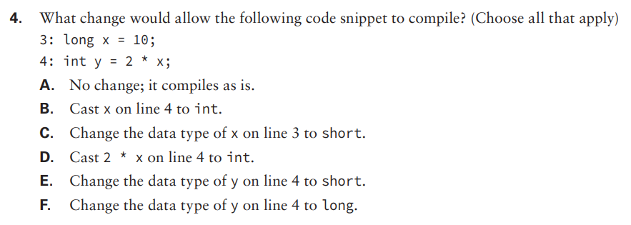

- ## 4: Options B, C, D and F. Option A is false because we indeed have a compiling issue. Option B is correct because if we downcast 'x' on line 4 to int, it would fit inside 'y' just fine. If we changed the data type of 'x' on line 3 to short, it would be upcasted to int on line 4, making option C correct. Also, if we cast 2 * x on line 4 to int, it would also fit because 2 * x is upcasted to a long, therefore would nedd a downcastig before being applied to 'y', making option D also correct. Option E is incorrect because the operation 2 * x results in a long value. We would need a value type that fits long, not an even smaller value type. But in option F we have exactly that! Turning y into a long would fit the long result, making this one correct as well.

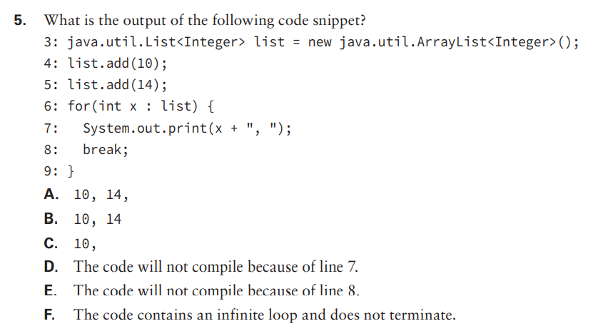

- ## 5: Option C. The 'break' operator on line 8 would make the 'for' only execute once. We do not have any compiling nor infinite loops, so the three last options are false as well.

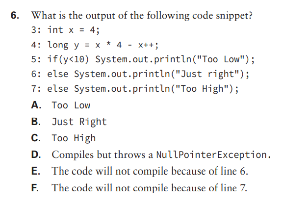

- ## 6: Option F. While we can use 'if-else' statements without a curly-braces-defined block, what we cannot do is use two 'else' statements back to back. What we can do is use 'if-elseif-else' statements, or delete line 6 or 7  in order for our code to compile correctly.

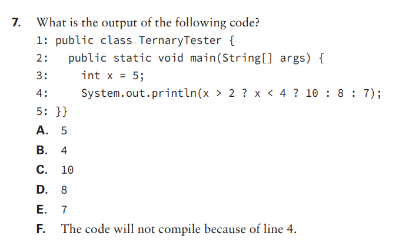

- ## 7: Option D. This is a nested ternary operation. If we apply brackets to increase readability, we wil have System.out.println((x > 2) ? ((x < 4) ? 10 : 8) : 7). In this case, we should solve the outside operation first: (x > 2) ? (n) : 7. Because (x > 2) is true, we have to solve the inside operation 'n': (x < 4) ? 10 : 8. As we see in this one, 'x' (5) is bigger than 4, so the result is 8.

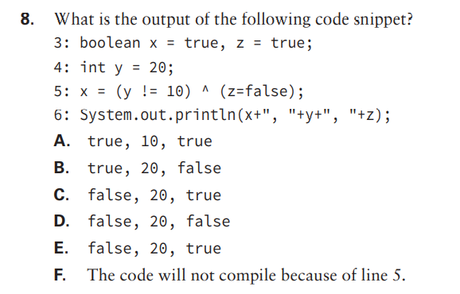

- ## 8: Option B. On line 5 we can see that 'y' does not equal to 10 and 'z' receives and returns false, but as the '^' operator is an exclusive 'or', we have one true and one false operators, returning 'true'.

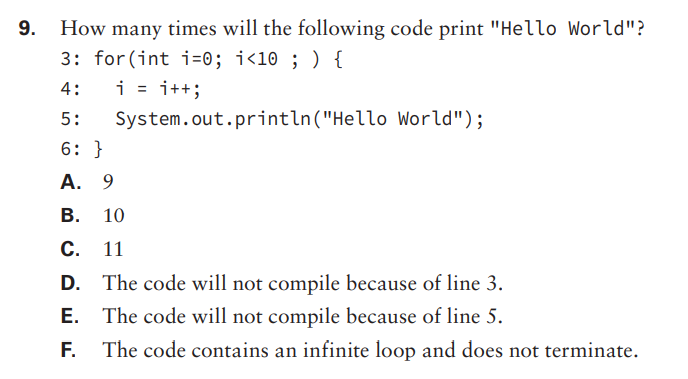

- ## 9: Option F. Here we have an infinite loop, because although the inside block increments 'i', the 'for' is missing it's variable modifier (which is fine because it is optional), so the inside block increments but the 'for' resets it to 0.

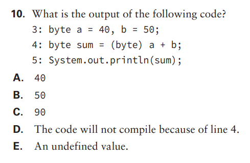

- ## 10: Option D. On line 4 we have what is supposed to be a downcasting from int to byte (because the sum of two bytes results in an int), but without the brackets the casting (byte) is applied to 'a', not to a + b.

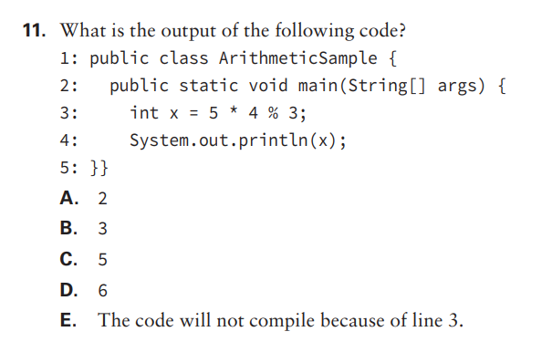

- ## 11: Option A. As we don't have brackets to define order preference, the operation goes left to right. 5 * 4 is 20, and the rest from 20/3 is 2.

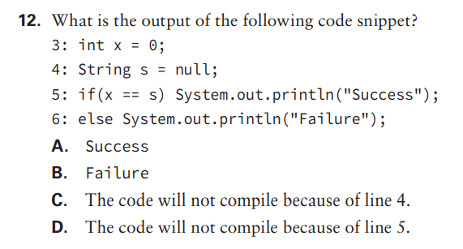

- ## 12: Option D. The code does not compile because we are trying to compare two different data types which cannot be casted into one another automatically.

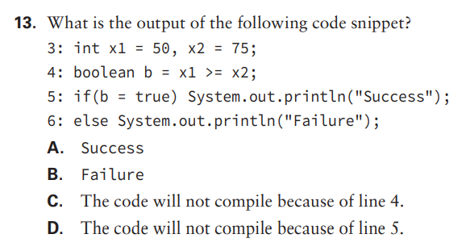

- ## 13: Option A. The code compiles and is correct, but 'if(b = true)' will always return true, so it will always be success, no matter what 'b' was assigned before. If we want to really test it, the 'if' should be 'if(b == true)'.

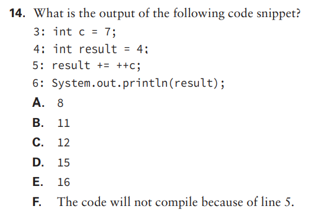

- ## 14: Option C. The code compiles with no problems. On line 5, first 'c' is incremented to 8, then it is added to 'result' (4) and attributed to it, resulting in 12.

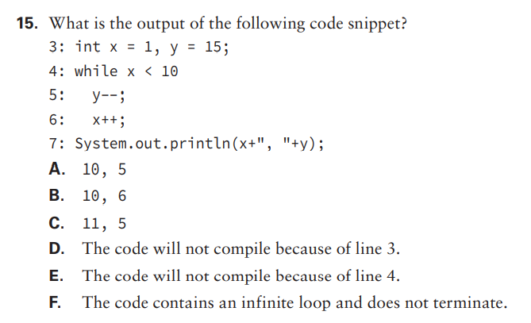

- ## 15: Option E. The 'while' statement in Java must have parentheses around the condition.

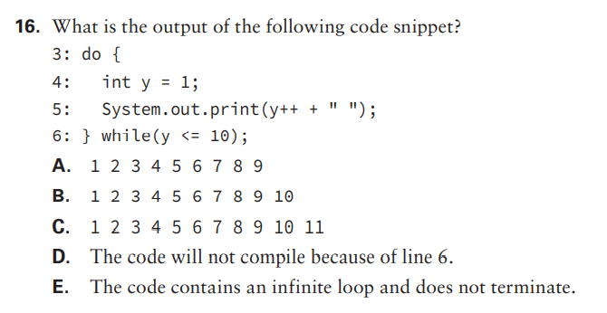

- ## 16: Option D. For this code to compile, the variable 'y' must be declared outside of the scope of the while.

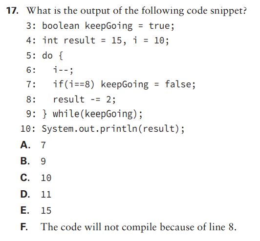

- ## 17: Option D. On the first loop, 'i' will be 9, 'keepGoing' will be true and 'result' will be 13. On the second loop,  'i' will be 8, 'keepGoing' will be false and 'result' will be 11. Because 'result' is now false, the loop stops.

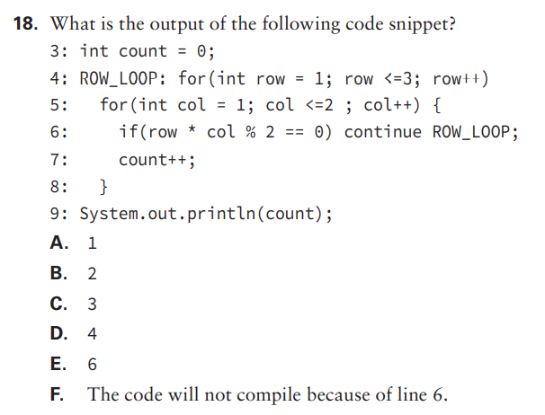

- ## 18: Option B. The result is 2 because the expression on line 5 is true when row * col is an even number, iterating over it two times.

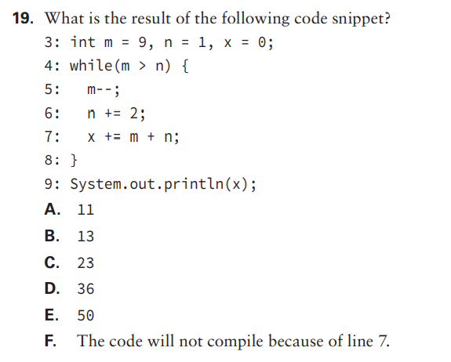

- ## 19: Option D. The 'while' loops four times, adding 'm' and 'n' to 'x'.

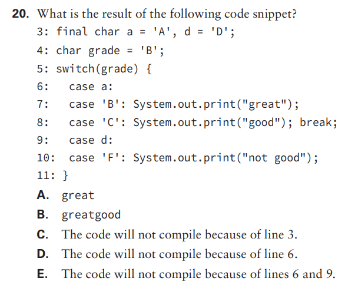

- ## 20: Option B. The 'switch' will receive 'B' and print "great", but it does not have a 'break' statement, so it will continue until it finds the 'break', which is on the next line.

